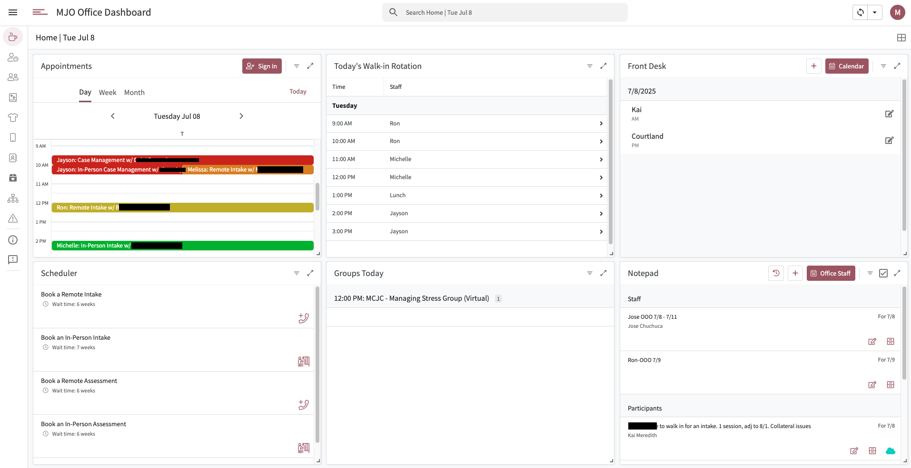

# 🏠 Home View
-
The **Home** view is the default landing screen for staff, designed as a central dashboard for daily office operations. It dynamically displays the current date and aggregates multiple subviews that reflect real-time information on participants, appointments, and internal workflows.

---

## 🧱 View Type
- **Type**: Dashboard
- **Display Name Formula**:  
  ```appsheetscript
  CONCATENATE("Home | ", TEXT(NOW(), "ddd MMM D"))
  ```

- **Visibility Condition**:
  ```appsheetscript
  useremail() <> "mjo80conf@gmail.com"
  ```
  *This hides the Home view on the iPad used for inventory.*

---

## 🧩 Subview: Appointments

### 🔹 View Type: Calendar  
- **Table**: `Appointments`

### 🔧 View Options:
| Setting        | Value               |
|----------------|---------------------|
| Start Date     | `Appointment Date`  |
| Start Time     | `Appointment Time`  |
| End Date       | `Appointment Date`  |
| End Time       | `endtime`           |
| Description    | `Type with Participant` |
| Category       | `Case Manager`      |
| Default View   | `Day`               |

---

## ⚡ Action: Check In

This is a **Quick Action** shown prominently in the Appointments calendar. It creates a new row in the `Participant Log` table when staff mark someone as checked in.

| Attribute         | Value |
|------------------|-------|
| **Type**          | `Data: add a new row to another table` |
| **Target Table**  | `Participant Log` |
| **Set Columns**   | See below |
| **Position**      | `Prominent` |
| **Show If**       | `OR(CONTAINS([Case Manager], "In-Person"), CONTAINS([Appointment Type], "In-Person"))` |
| **Confirmation**  | `CONCATENATE("Check In ", [Participant], "?")` |

**Set Column Values:**
```text
Name         = [Participant]
Visit Reason = [Appointment Type]
CM           = [Full Case Manager]
Notes        = [Notes]
Walk In Date = today()
Check In     = timenow()
Status       = "Waiting Area"
```

---

## 🔄 Action: Sign In (Navigation)

This action enables quick navigation from the Appointments calendar to the **Sign In** form at the front desk. While the "Check In" button provides rapid appointment check-ins, this action routes to the full sign-in workflow for walk-ins and detailed participant logging.

| Attribute        | Value |
|-----------------|-------|
| **Action Name**  | `Sign In` |
| **Type**         | `App: go to another view within this app` |
| **Target**       | `LINKTOVIEW("Sign In")` |
| **Table**        | `Appointments` |
| **Position**     | `Primary` |
| **Display Name** | `"Sign In"` |

---

## 📎 Notes

- This dashboard is used live in office every day.
- The Quick Check In action reduces friction by automatically logging arrivals with a timestamp and routing them to the "Waiting Area" flow.
- The confirmation prompt helps prevent mis-clicks during rapid client check-ins.

---

## 📷 Screenshots

*Screenshots to be added to `dashboard/home/images/` directory:*
- `appointments-view-settings.png`
- `check-in-action-settings.png`
- `sign-in-action-settings.png`
- `home-dashboard-overview.png`

---

### 🧠 Next Steps

- Drop your screenshots into `dashboard/home/images/` and rename them cleanly
- Add the next subview or feature from the Home dashboard when you're ready (e.g. Waiting Area)
- Document any additional actions or workflows specific to the Home view

---

*This documentation reflects the current state of the Home view as of the latest AppSheet configuration.*
