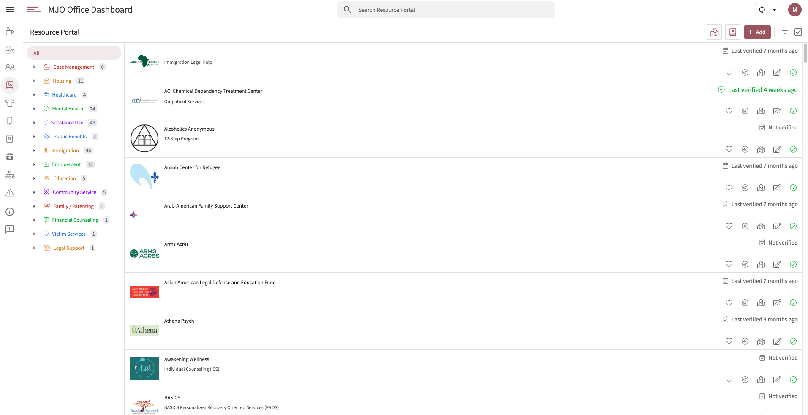
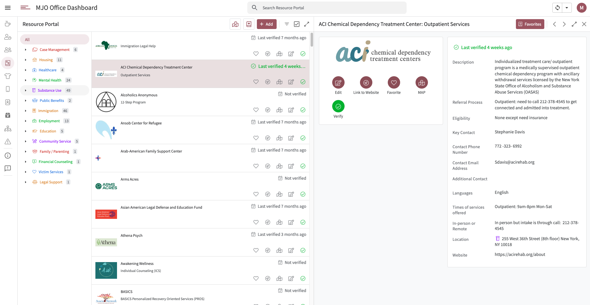
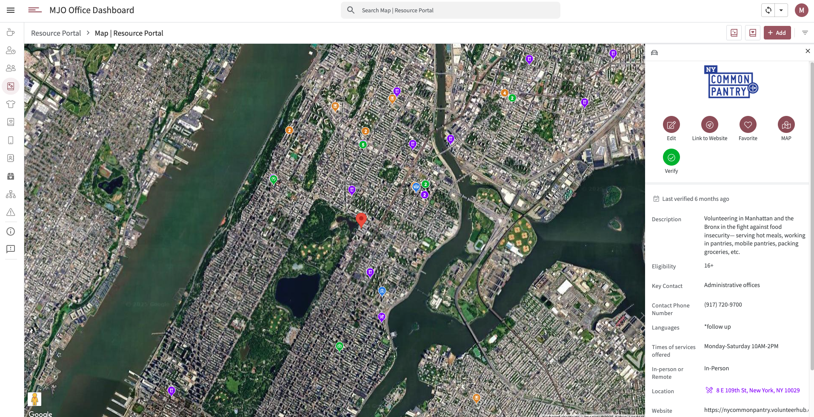

# Resource Portal - MJO Dashboard

## Overview

The Resource Portal is an internal database of NYC area service providers designed to streamline participant referrals and improve service delivery. This comprehensive resource management system serves as a collective knowledge base for staff, containing information about service organizations specializing in housing, healthcare, mental health, and more. 

## Purpose and Functionality

The Resource Portal functions as a centralized repository where staff can quickly access and manage referral information for participants. It supports bookmarking go-to resources, Google Maps integration, and a <i>Verify</i> button that timestamps a provider when a case manager confirms the information is accurate following a successful referral.

## Screenshots

*Main gallery view showing service providers with filtering and search capabilities*

*Detailed resource information with action buttons and contact details*

*Interactive map showing service provider locations with integrated navigation*

[↑ Jump to top](#table-of-contents)

## Key Features

### 1. **Comprehensive Service Database**
- Housing assistance programs
- Healthcare providers and clinics
- Mental health services
- Substance use treatment facilities
- Public benefits enrollment support
- Immigration legal services
- Employment and job training programs
- Educational institutions and GED programs
- Community service organizations
- Legal aid and support services

### 2. **Interactive Map Integration**
- Visual location mapping for all service providers
- Quick access to directions via integrated Google Maps
- Geographic clustering to identify services by area
- Street-level navigation for field staff and participants

### 3. **Document Management**
- PDF upload capability for referral one-pagers
- Centralized storage of service provider brochures
- Quick access to program-specific documentation
- Standardized referral forms and templates

### 4. **Data Verification System**
- **Verify Button**: Timestamps resources with "Last verified X days/months ago"
- Ensures data freshness and accuracy
- Tracks verification history for quality control
- Promotes regular data maintenance by staff

[↑ Jump to top](#table-of-contents)

### 5. **Personalized Favorites System**
- **Favorite Button** (outlined heart icon): Bookmark frequently used resources
- **Unfavorite Button** (solid heart icon): Remove bookmarked resources
- Personal favorites list for each staff member
- Conditional "My Favorite Resources" view based on user preferences

### 6. **Quick Access Actions**
- **Link to Website**: Direct access to service provider websites
- **Edit**: Modify resource information and details
- **MAP**: Open location in mapping application
- **Verify**: Update verification timestamp
- **Favorite/Unfavorite**: Personal bookmark management

## User Interface Components

### Resource Display
Each resource entry includes:
- **Organization Logo**: Visual identification (auto-assigned)
- **Organization Name**: Primary identifier
- **Service Category**: Classification of services provided
- **Contact Information**: Phone numbers and email addresses
- **Address**: Physical location with map integration
- **Referral Process**: Step-by-step referral instructions
- **Eligibility Requirements**: Target population and criteria
- **Key Contact**: Primary point of contact for referrals
- **Last Verified**: Data freshness indicator

### Action Buttons
- **Edit**: Modify resource information
- **Link to Website**: Direct web access
- **Favorite/Unfavorite**: Personal bookmarking
- **MAP**: Geographic navigation
- **Verify**: Data verification timestamp

[↑ Jump to top](#table-of-contents)

## AppSheet Configuration

### View Configuration

#### View Settings
- **View Name**: Resource Portal
- **View Type**: Gallery view with card layout
- **Data Source**: Resource Portal table
- **Position**: Next (secondary navigation position)

#### Display Options
- **Image Shape**: Full Image (selected from Square, Round, or Full options)
- **Main Image**: Auto assign (Logo Image) field
- **Primary Header**: Auto assign (Organization name)
- **Secondary Header**: Auto assign (Service Name)
- **Summary Column**: LastVerifiedVirtual (displays verification status)

#### Sorting and Grouping
- **Sort by**: Organization name (Ascending)
- **Group by**: 
  - Service Category (Ascending)
  - Organization name (Ascending)
  - _RowNumber (Ascending)
- **Group aggregate**: COUNT (displays number of resources per group)

#### Action Bar Configuration
- **Show action bar**: Enabled
- **Actions**: Manual selection with the following options:
  - **Verify**: Updates verification timestamp
  - **Unfavorite 2**: Removes from favorites (solid heart icon)
  - **Favorite**: Adds to favorites (outlined heart icon)
  - **Open Url (Website)**: Direct website access
  - **Open File (One Pager)**: Access uploaded PDFs
  - **View Map (Location)**: Geographic navigation

[↑ Jump to top](#table-of-contents)

### Favorites System Implementation

#### Favorite Action
- **Function**: Adds new row to Resource Portal Favorites table
- **Referenced Data**: ResourceID of current resource
- **User Assignment**: Automatically uses USEREMAIL() function
- **Conditional Display**: Shows "My Favorite Resources" view when COUNT(FILTER("Resource Portal Favorites", [User] = USEREMAIL())) > 0

#### Unfavorite Action (Complex Implementation)
- **Referenced Rows**: `SELECT(Resource Portal Favorites [FavID], AND([ResourceID] = [_THISROW].[ResourceID], [User] = USEREMAIL()))`
- **Referenced Action**: Delete
- **Show Condition**: `IN([ResourceID], SELECT(Resource Portal Favorites [ResourceID], [User] = USEREMAIL()))`
- **Visual Indicator**: Solid heart icon (vs. outlined heart for favorite)

#### Visual Differentiation
- **Favorite Button**: Outlined heart icon (add to favorites)
- **Unfavorite Button**: Solid heart icon (remove from favorites)
- **Dynamic Display**: Shows appropriate button based on current favorite status

[↑ Jump to top](#table-of-contents)

### Data Verification System
- **Verify Button**: Updates LastVerifiedVirtual field
- **Timestamp Format**: "Last verified X days/months ago"
- **Automatic Calculation**: Virtual column calculates time since last verification
- **Quality Control**: Encourages regular data maintenance

[↑ Jump to top](#table-of-contents)

### Technical Implementation Notes
- **User Authentication**: USEREMAIL() function for personalized features
- **Conditional Logic**: Dynamic view display based on user preferences
- **Referential Integrity**: Proper linking between Resource Portal and Favorites tables
- **Data Validation**: Ensures accurate resource information through verification system

[↑ Jump to top](#table-of-contents)

## Best Practices

### For Staff Usage
1. **Regular Verification**: Use verify button when contacting service providers
2. **Favorite Management**: Bookmark frequently used resources for quick access
3. **Information Updates**: Edit resource details when changes are discovered
4. **Documentation**: Upload relevant PDFs for comprehensive resource information

### For System Maintenance
1. **Data Quality**: Encourage staff to verify resources during regular use
2. **Content Updates**: Regular review of service provider information
3. **User Training**: Ensure all staff understand favorites and verification systems
4. **Performance Monitoring**: Track usage patterns to identify most valuable resources

[↑ Jump to top](#table-of-contents)